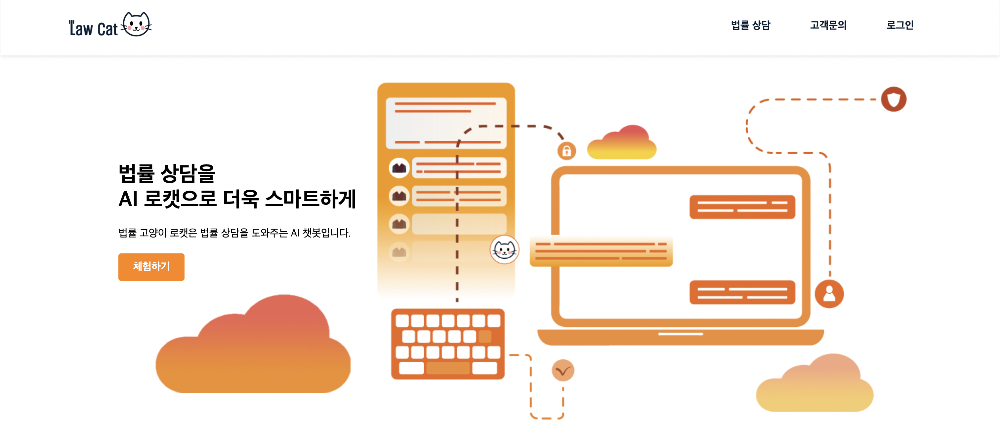
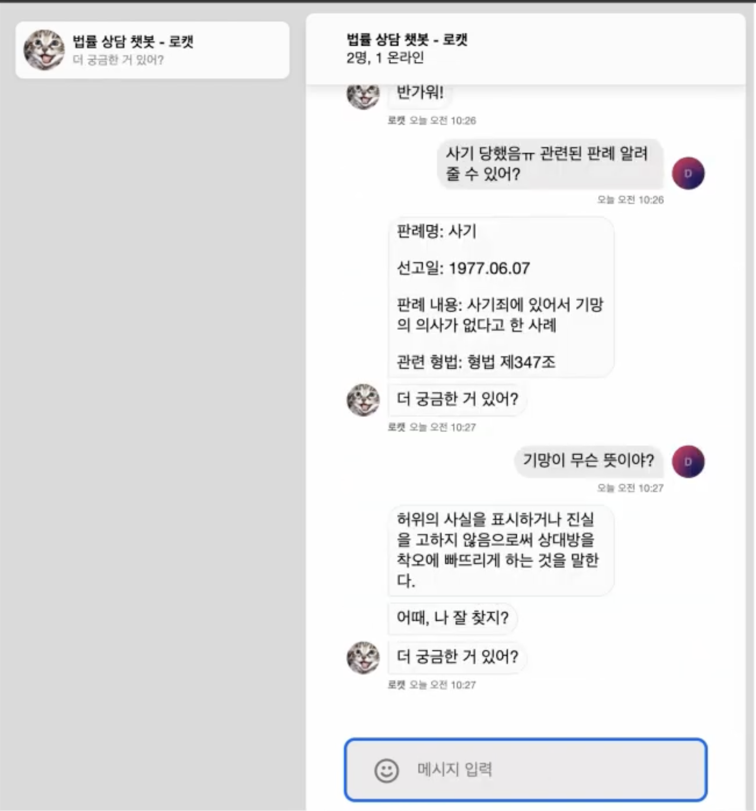

## SW 중심대학 공동해커톤 참여 - 한국소프트웨어산업협회장상 수상

Hello, I'm a LawCat.

LawCat provides legal counseling services through AI chatbots
In addition, we also provide services through chat counseling and video counseling with lawyers.

Existing legal services take a lot of time to get answers.
Even a simple answer costs a lot of money, and it has poor accessibility because of its distinctive hard image

On the other hand, if we use our services, we can use AI chatbots to solve existing financial and time costs

LawCat has increased accessibility with its easy-to-use UI/UX and cute characters.
